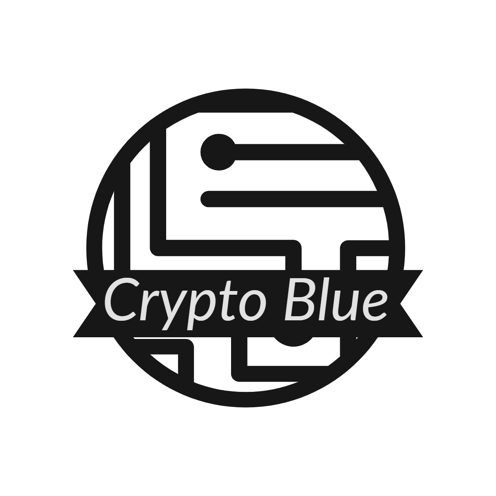

# Crypto Blue Web

>Plataforma Web de Crypto Blue

## Descripcion

El sitio Web Crypto Blue tiene como finalidad facilitar los calculos de conversión para el usuario final que desea calcuar un criptoactivo en pesos argentinos comparando con el Dólar Blue o paralelo, y el Dólar oficial.

Por lo pronto solo se listan las Criptomonedas con más renombre.

## Detalles del Proyecto

### Tecnologias Aplicadas

* HTML, CSS y JavaScript Vanilla
* ReactJS
* Create React App
* Axios
* Chakra UI

### Diseño de la plataforma

* El diseño de la plataforma esta adaptado a Desktop, Tablet y mobile (responsive)

## Autor

Desarrollador y Diseñador del proyecto

Oliva Clariá, Benjamín  
* Linkedin: [https://www.linkedin.com/in/benjamin-oliva-clariá-953454181](https://www.linkedin.com/in/benjamin-oliva-clariá-953454181)
* Instagram: [@benjaaoliva](https://instagram.com/benjaaoliva/)
* 

## Historial de Versiones

* 1.0
    * Publicación del Proyecto en GitHub

## Etapa del Desarrollo

* El proyecto se encuentra en Desarrollo.

## Herramientas de desarrollo

* Visual Studio Code
    * Extensiones:
        * [Error Lens](https://marketplace.visualstudio.com/items?itemName=usernamehw.errorlens)
        * [Bookmarks](https://marketplace.visualstudio.com/items?itemName=alefragnani.Bookmarks)
        * Otras extensiones de formateo de codigo...
* Navegador Brave
* GitHub Desktop App

## Créditos de Uso e Inspiraciones

Diseño propio, inspirado en templates de componentes de Chakra UI.
